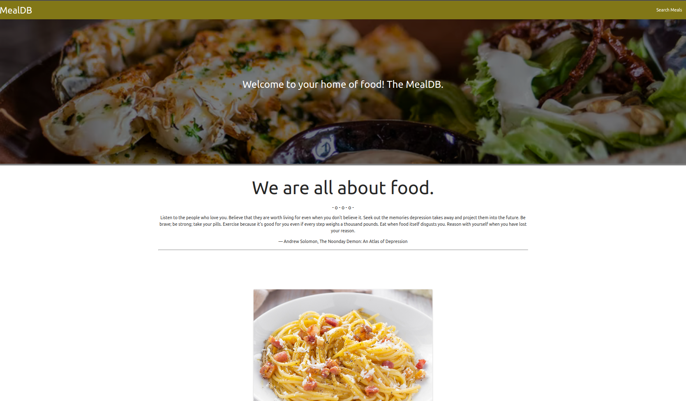
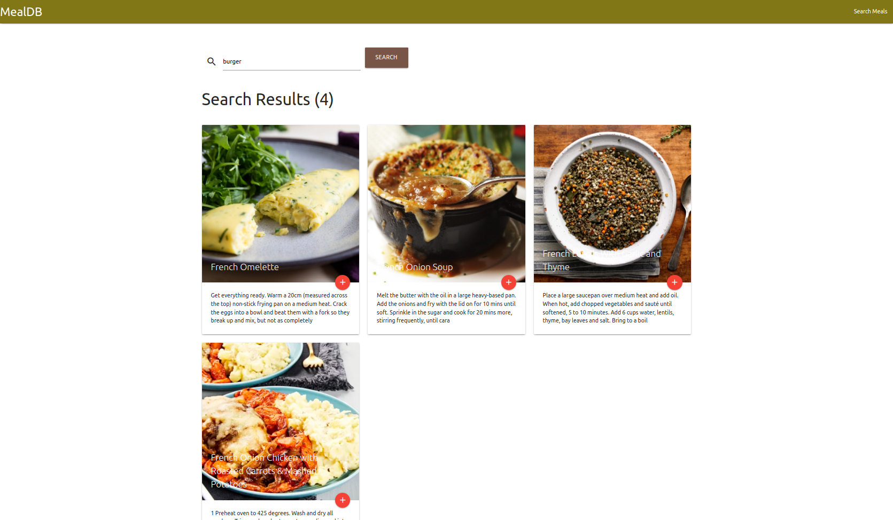

# MealDB

   

# Description
A simple meals' application that has recipes on how to prepare them. 
A simple app built with angular.

# Live Link

[Meal DB Live](https://otsembo.github.io/MealDB/home)

# Getting Started
In order for you to use the content on this repo ensure you have the following:

- A computer that runs on either of the following; (Windows 7+, Linux, Mac OS)
- nodejs 9.0+
- Some bit of patience for your own sanity.

## Installation

To use this repo on your machine requires some simple steps

### Alternative One

- Open a terminal / command line interface on your computer
- Clone the repo by using the following:

        git clone https://github.com/otsembo/MealDB.git

- Be patient as it creates a copy on your local machine for you.
- Change directory to the repo folder:

        cd MealDB

- (Optional) Open it in ``Visual Studio Code``

        code .

- (Alternate Option) Open it in any editor of your choice.
- Hurray! You are one step closer to being as intelligent as Einstein.

### Alternative Two

- On the top right corner of this page there is a button labelled ``Fork``.
- Click on that button to fork the repo to your own account.
- Take on the process in ``Alternative One`` above.
- Remember to replace your username when cloning.

        git clone https://github.com/your-username-here/MealDB.git

# Running the application

Running the application is very straight forward. You can use the following steps to run the app.

- Install required dependencies from npm

      npm install
- Run the application on the browser

      ng serve -o

# Screenshots

Take a snippet at what the application looks like

| HOME SCREEN                                 | SEARCH SCREEN                                 |
|---------------------------------------------|-----------------------------------------------|
|  |  |

# Authors
This project was contributed to by:
- [Ian Okumu](https://github.com/otsembo/)

# License
The project is licensed under Apache 2.0.
